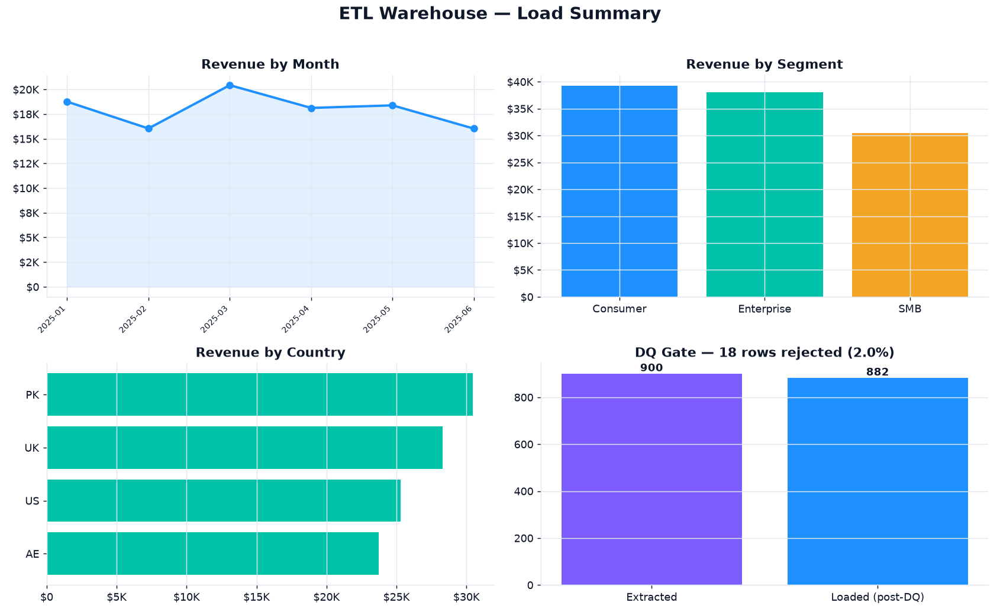
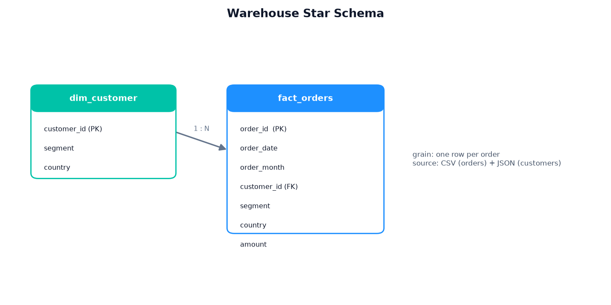

# 🏗️ ETL Pipeline → SQLite Star-Schema Warehouse

> A modular **extract → transform → data-quality gate → load → report** pipeline
> that lands messy CSV + JSON sources into a modeled star schema — and refuses to
> load a single row that fails validation.

<p>
  
  
  
  
  
  
</p>

---

## 📊 Warehouse load summary

Generated by `pipeline.py` — reconciled straight from the loaded SQLite warehouse:



## ⭐ Data model



---

## Why this project

A BI platform is only as trustworthy as the pipeline behind it. The failure mode
that erodes trust isn't a broken chart — it's **silently loading bad data**: a
null amount that skews a total, a duplicate order that double-counts revenue. This
pipeline models that discipline end to end: it pulls from two source formats
(CSV + JSON), cleans and dedupes into a proper fact/dimension star schema, runs a
**hard data-quality gate that aborts the load on failure**, and then reconciles
the warehouse back to the source counts so the numbers are provably complete.

## What it does

| Stage | File | Output |
|---|---|---|
| **Extract** raw orders (CSV) + customers (JSON), as if landed from upstream | `etl/extract.py` | `data/raw/*` |
| **Transform** — drop null amounts, dedupe on PK, enrich, model into a star schema | `etl/transform.py` | `fact_orders` + `dim_customer` |
| **Gate** — validate the fact table; raise `DQError` and abort on any failure | `etl/data_quality.py` | pass/fail per check |
| **Load** modeled tables into a SQLite warehouse | `etl/load.py` | `data/warehouse.db` |
| **Report** — reconcile via SQL, draw the star schema + load dashboard | `etl/report.py` | `outputs/*` , `docs/*` |
| **Orchestrate** the whole run | `pipeline.py` | console + artefacts |
| **Verify** every stage's contract | `tests/test_pipeline.py` | `pytest` |

## 📈 Latest run (deterministic — seeded RNG)

| Metric | Value |
|---|---|
| Rows extracted | 900 |
| **Rejected by DQ gate** | **18 (2.0%)** — seeded null amounts |
| Fact rows loaded | **882** |
| Customer dimension rows | 399 |
| Distinct customers with orders | 354 |
| Total warehouse revenue | **$107,748.27** |
| Average order value | $122.16 |
| Top segment | **Consumer** ($39,265.23) |
| DQ checks passed | 4 / 4 |

> Full machine-readable summary: [`docs/warehouse_summary.json`](docs/warehouse_summary.json).
> Extracted = loaded + rejected (900 = 882 + 18), and segment revenues reconcile
> to the warehouse total — the pipeline balances.

## Data model

A textbook star schema, grain **one row per order**:

- **`fact_orders`** — `order_id (PK)`, `order_date`, `order_month`, `customer_id (FK)`,
  `segment`, `country`, `amount`. Denormalised segment/country onto the fact for
  fast slicing, mirroring a gold-layer reporting table.
- **`dim_customer`** — `customer_id (PK)`, `segment`, `country`.

Sample fact rows: [`docs/sample_fact_orders.csv`](docs/sample_fact_orders.csv).

## Data-quality gate

`validate()` runs before load and **raises `DQError` on any failure**, so a bad
batch never reaches the warehouse. Current checks:

- `fact_not_empty` — the load has rows to write.
- `no_null_order_id` — every fact row has a primary key.
- `amount_non_negative` — no negative money slips through.
- `customer_id_present` — every order links to a customer.

The test suite proves the gate has teeth: injecting a negative amount makes
`validate()` raise, not warn.

## ▶️ Run it

```bash
pip install -r requirements.txt
python pipeline.py     # extract -> transform -> DQ gate -> load -> report
pytest -q              # 7 tests
```

First run seeds the raw sources under `data/raw/`; subsequent runs reuse them, so
results are reproducible.

## 🧪 Tests

`tests/test_pipeline.py` covers each stage's contract: extract shapes, the
transform's star-schema columns + null-drop + PK dedupe + non-negative amounts,
that dirty rows really are rejected, that the DQ gate **passes on clean data and
raises on bad**, that the load round-trips through SQLite with both tables
present, and that the reconciled summary balances (extracted = loaded + rejected,
segment revenue sums to the total).

## 🗂️ Project structure

```
etl-pipeline-warehouse/
├── etl/
│   ├── extract.py         # CSV + JSON source extraction (seeded)
│   ├── transform.py       # clean, dedupe, star-schema modeling
│   ├── data_quality.py    # validation gate (raises DQError)
│   ├── load.py            # SQLite warehouse loader
│   └── report.py          # SQL reconciliation + star diagram + dashboard
├── tests/
│   └── test_pipeline.py   # pytest invariants across all stages
├── docs/                  # committed dashboard, star schema, summary, data sample
├── pipeline.py            # orchestrator
├── requirements.txt
└── README.md
```

## 🛠️ Stack

`pandas` · `sqlite3` · `matplotlib` · `pytest` · modular ETL design

---

<sub>Part of my data & analytics portfolio — [github.com/syedjawaadali](https://github.com/syedjawaadali). Data is synthetic; no real data used.</sub>
